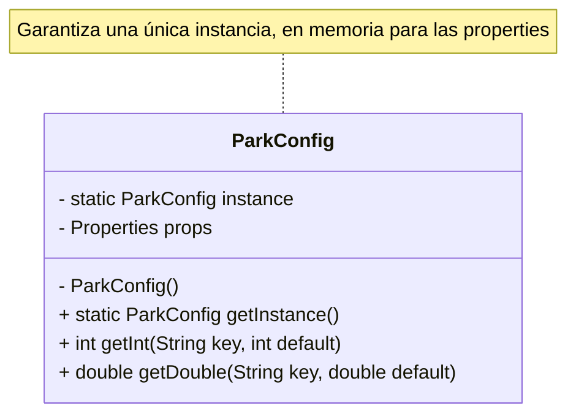
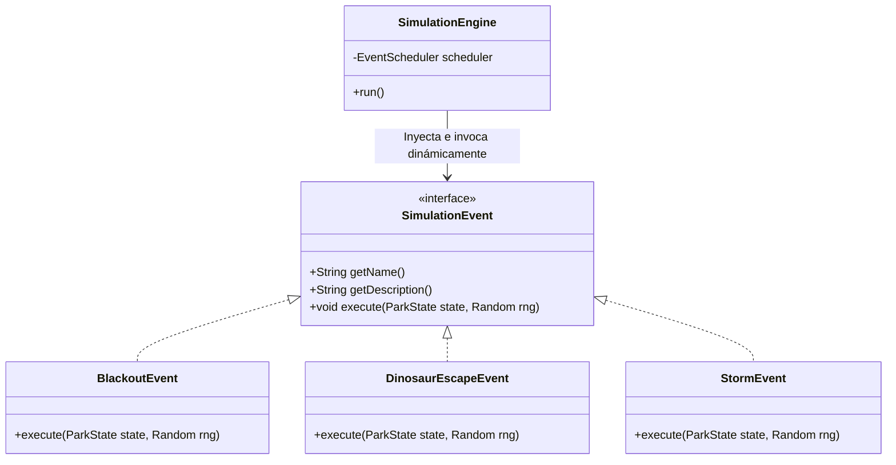

# Simulador de Parque de Dinosaurios (Bloque Intermedio)

Motor de simulación determinista basado en turnos para la gestión de un parque de atracciones de dinosaurios. Este proyecto modela el comportamiento de turistas, trabajadores, recintos y eventos aleatorios utilizando principios sólidos de Programación Orientada a Objetos (POO) y patrones de diseño.

## Tecnologías Utilizadas
* **Lenguaje:** Java 17
* **Gestor de Dependencias:** Maven
* **Base de Datos:** H2 (En memoria)
* **Migraciones de BD:** Liquibase
* **Pruebas Unitarias:** JUnit 5 & Mockito

## Arquitectura y Patrones de Diseño
El motor de simulación está diseñado priorizando la escalabilidad y el mantenimiento:

* **Singleton:** Utilizado en `ParkConfig` para garantizar una única instancia global de lectura del archivo `park.properties`.



* **Strategy Pattern:** Implementado en el sistema de eventos (`SimulationEvent`). Permite la ejecución dinámica de eventos (Fugas, Tormentas, Apagones, Promociones y Fallas mecánicas) sin modificar el motor principal.



* **Polimorfismo:** Aplicado en las entidades del parque (como `Worker` delegando comportamientos a `Guard` y `Technician`).

## Características del Bloque Intermedio
1. **Persistencia Real:** Uso de base de datos relacional (H2) con generación automática del esquema vía Liquibase.
2. **Generación Segura de IDs:** Implementación de un Contador Maestro Sincronizado en `DatabaseService` para evitar colisiones de llaves primarias en transacciones concurrentes.
3. **Gestión de Vehículos:** Los técnicos dependen del estado operativo de los vehículos (`VehicleStatus`) para realizar mantenimientos en la planta de energía.
4. **Nuevos Eventos:** Incorporación de `PromoHourEvent` (impulso económico) y `VehicleBreakdownEvent` (desgaste de recursos).

## Instrucciones de Ejecución

### 1. Compilación y Pruebas (Cobertura > 65%)
Para ejecutar la suite de pruebas unitarias y verificar la cobertura del código, además de compilar el proyecto, ejecuta en la terminal:
```bash
mvn clean test
```

### 2. Ejecutar la Simulación Principal
Para arrancar el motor de simulación de 100 pasos, ejecuta el método principal de la aplicación:
```bash
mvn compile exec:java "-Dexec.mainClass=com.axity.dinosaurpark.Main"
```
